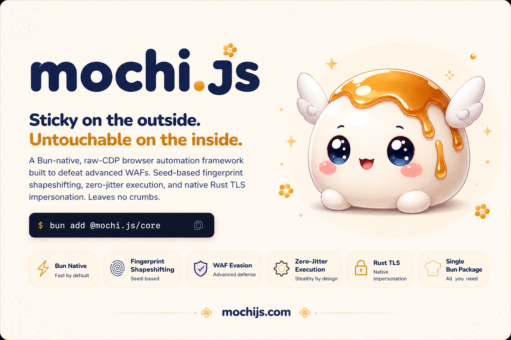

<p align="center">
  
</p>

<p align="center">
  <strong>One coherent stack for stealth browser automation — relational fingerprint locking, JIT-installed spoofing, behavioral playback, and JA4-impersonating out-of-band HTTP.</strong>
</p>

<p align="center">
  <a href="https://www.npmjs.com/package/@mochi.js/core"></a>
  <a href="LICENSE"></a>
  <a href="https://github.com/0xchasercat/mochi/actions/workflows/pr-fast.yml"></a>
  <a href="https://github.com/0xchasercat/mochi/stargazers"></a>
  <a href="https://bun.sh">= 1.1"></a>
</p>

---

`mochi` is a Bun-native browser automation framework that replaces the usual hand-stitched stack — **Patchright + fingerprint-injector + Turnstile clicker + curl-impersonate + Playwright wrapper** — with one library that owns the whole pipeline. It drives stock [Chromium-for-Testing](https://googlechromelabs.github.io/chrome-for-testing/) over a `--remote-debugging-pipe` (no TCP port, no `Runtime.enable`), installs JIT-friendly proxies before any page script runs, synthesizes Bezier+Fitts mouse paths, and routes out-of-band HTTP through a Rust [`wreq`](https://github.com/0x676e67/wreq) FFI for byte-accurate JA4/JA3/H2 fingerprints.

It is **v0.1** software. Read the [What works / what doesn't](#what-works--what-doesnt) section before depending on it.

## Quickstart

```sh
bun add @mochi.js/core @mochi.js/cli
bunx mochi browsers install
```

```ts
// hello-mochi.ts
import { mochi } from "@mochi.js/core";

const session = await mochi.launch({
  profile: "linux-chrome-stable",
  seed: "user-12345",
});

const page = await session.newPage();
await page.goto("https://httpbin.org/headers");

console.log("UA:", session.profile.userAgent);
console.log("Locale:", session.profile.locale);

await session.close();
```

```sh
bun run hello-mochi.ts
```

The full 5-minute walkthrough — profile selection, first `humanClick`, expected console output, troubleshooting — is in [`docs/quickstart.md`](docs/quickstart.md).

> Bun ≥ 1.1 only. Node and Deno are not targets (invariant I-3, see [`PLAN.md`](PLAN.md) §2). The first `bunx mochi browsers install` downloads stock Chromium-for-Testing; subsequent runs are cached.

## What you get

- **Relational locking, not randomization.** Every fingerprint surface (canvas, WebGL, audio, fonts, timing, MediaDevices, WebGPU, …) derives from a single `(profile, seed)` pair through a 40-rule DAG. No Frankenstein fingerprints — a Mac UA never lands next to Linux WebGL.
- **Zero-jitter spoofing.** A single ~50KB inject payload runs at top-of-frame via `Page.addScriptToEvaluateOnNewDocument({ runImmediately: true })`. JIT-friendly Proxy traps, no async round-trips when a WAF micro-times `performance.now()`.
- **Behavioral synthesis.** `humanClick` / `humanType` / `humanScroll` derive from biomechanical models — Bezier paths with overshoot+correction, Fitts-law movement times, lognormal digraph delays, Gaussian jitter — all parameterized per profile (`hand`, `tremor`, `wpm`, `scrollStyle`).
- **JA4-coherent out-of-band HTTP.** `session.fetch(url)` ships through Bun:FFI → Rust crate → [`wreq`](https://github.com/0x676e67/wreq), so fetched bytes carry the same TLS/H2 fingerprint as the spoofed Chrome profile.
- **Probe-Manifest harness.** `bun run harness:smoke` captures a [Probe Manifest](https://github.com/CloakHQ/peekaboo) from the live session and diffs it against per-profile baselines. Zero-Diff is a CI gate; intentional divergences live in `expected-divergences.json` next to a rationale.
- **Stock Chromium.** No forks, no patches, no proprietary infrastructure. Pinned Chromium-for-Testing, auto-downloaded by `mochi browsers install`. BYO via `binary: <path>`.

## What works / what doesn't

Direct port from [`docs/limits.md`](docs/limits.md) — the architectural-honesty page. Every entry there has a root cause and a tracking link. mochi gives you the best possible JS-layer answer for stealth automation against Chromium-family WAFs; some things genuinely require a Chromium patch and we name them.

| Surface | v0.1 status | Notes |
|---|---|---|
| CDP pipe transport (`--remote-debugging-pipe`) | works | No TCP port, no `Runtime.enable`. |
| `Page.goto` / `content` / `evaluate` | works | `evaluate` is `Runtime.callFunctionOn`-based — JSON-serializable returns only. |
| `Page.goto({ waitUntil: "networkidle" })` | partial | Mapped to `"load"` until per-frame `Network.enable` lands. |
| Relational fingerprint Matrix (40 rules) | works | `(profile, seed)` → `MatrixV1`, deterministic, JSON round-trippable. |
| JS-layer spoofing (UA / UA-CH, navigator, WebGL, WebGPU, MediaDevices, Permissions, screen, fonts, timezone, locale) | works | Inject payload, JIT-proxy traps, top-of-frame. |
| Audio (`OfflineAudioContext`) byte-accurate fingerprint | deferred | Per-(profile, sample-rate) byte tables land in v0.7 capture (task 0071). |
| Canvas (`toDataURL`) byte-accurate fingerprint | deferred | Same — precomputed hash maps + per-pixel noise in v0.7. |
| Behavioral synthesis (`humanClick` / `humanType` / `humanScroll`) | works | Bezier+Fitts+jitter; profile-parameterized (`hand`, `tremor`, `wpm`, `scrollStyle`). |
| Profile catalog (`mac-m4-chrome-stable`, `win11-chrome-stable`, …) | partial | IDs validated; per-device baseline data lands phase 0.4. v0.1.x falls back to a Linux placeholder profile — Matrix is real, surface values are placeholder. |
| Trace recording / replay (`mochi record` → `humanClick(sel, { trace })`) | deferred | API surface forward-compatible; recorder lands in v1.x. |
| JA4/JA3/H2-coherent `session.fetch` via `wreq` | works | Prebuilt cdylibs for darwin-{arm64,x64}, linux-{x64,arm64}, win32-x64. |
| `session.fetch` on FreeBSD / Alpine musl / Windows arm64 | partial | No prebuilt; falls back to local `cargo build`. |
| `Page.screenshot` | not implemented | Phase 0.x follow-up. |
| Proxy auth (HTTP/HTTPS/SOCKS5) | works | Inline URL or `ProxyConfig` shape; CDP `Fetch.authRequired`, no extension. |
| Proxy-PAC scripts | not yet | Use system network policy until the flag lands. |
| Turnstile auto-click | not yet | Tracked in task 0220. |
| `bot.incolumitas.com` anti-debugger trap | known limit | C++-only fix path. Every CDP-driven tool trips it identically. |
| `deviceandbrowserinfo.com/are_you_a_bot` worker-injection trap | known limit | Same anti-debugger family as incolumitas. |
| `fingerprint.com/web-scraping` (datacenter IP, cold session) | known limit | Server-side IP-class scoring; route through residential. |
| Cross-engine FPU / JIT divergence (Safari-from-Chromium) | out of v1 scope | v1 is Chromium-family only. |
| Mobile / touch profiles | out of v1 scope | v2 roadmap. |

The [full limits document](docs/limits.md) has the per-vector root-cause analysis. Read it before opening an issue saying "X site detects mochi" — half the answers are already there.

## Comparison

mochi's peer group is the JS-layer stealth-automation tools that drive stock or near-stock Chromium. Each line is a structural axis, not a marketing axis. Per-library audit reports — covering exact CDP method surface, fingerprint patch list, and detected-by-X probe matrix — land under [`docs/audits/`](docs/audits/) (briefs in [`tasks/0200`](tasks/0200-audit-puppeteer-real-browser.md) – [`tasks/0203`](tasks/0203-audit-undetected-chromedriver.md); reports merging via PRs #4–#7).

| | mochi | [patchright](https://github.com/Kaliiiiiiiiii-Vinyzu/patchright) | [puppeteer-real-browser](https://github.com/zfcsoftware/puppeteer-real-browser) (archived) | [nodriver](https://github.com/ultrafunkamsterdam/nodriver) | [undetected-chromedriver](https://github.com/ultrafunkamsterdam/undetected-chromedriver) |
|---|---|---|---|---|---|
| Runtime | Bun ≥ 1.1 | Node | Node | Python | Python |
| Browser | stock CfT | stock Chromium | stock Chrome + helpers | stock Chrome | stock Chrome (patched binary) |
| `Runtime.enable` avoided | yes (asserted) | yes | no | partial | n/a (WebDriver) |
| `Page.createIsolatedWorld` avoided | yes | yes | no | yes | n/a |
| Relational `(profile, seed)` Matrix | yes | no | no | no | no |
| JS-layer fingerprint coverage (40-rule DAG) | yes | partial (~12 patches) | partial (fingerprint-injector add-on) | partial | partial (flag-level) |
| Probe-Manifest harness as CI gate | yes | no | no | no | no |
| Behavioral synthesis (`humanClick`/`humanType`) | yes (Bezier+Fitts+jitter) | no | mouse-helper only | mouse-only | no |
| JA4/JA3/H2-coherent out-of-band HTTP | yes (`wreq` FFI) | no | no | no | no |
| Single-runtime stack (no `pip install` next to `npm install`) | yes | yes | yes | yes (Python only) | yes (Python only) |
| Turnstile auto-click | not yet (task 0220) | yes | yes | partial | partial |
| Stable-Chrome quirks accumulated over 4+ years | no | partial | partial | yes | yes |
| Ecosystem maturity (issues / PRs / community) | new | mid | mid | mid | high |

**Where mochi wins today:** relational consistency, JA4 coherence, behavioral synthesis depth, harness-as-gate, single-runtime stack.

**Where mochi loses today:** ecosystem age, Turnstile auto-click, accumulated quirks-fixes from years of production deployment.

## How it fits together

```
┌──────────────────────── User code (TypeScript) ────────────────────────┐
│   import { mochi } from "@mochi.js/core";                              │
└────────────────────────────────┬───────────────────────────────────────┘
                                 │
            ┌────────────────────▼────────────────────┐
            │  @mochi.js/core   — launch, CDP pipe,   │
            │                     Page, Session       │
            └────┬─────────────┬───────────────┬──────┘
                 │             │               │
        ┌────────▼──┐  ┌───────▼──────┐  ┌─────▼──────┐
        │ inject    │  │ behavioral   │  │ net (TS)   │
        │ (payload) │  │ Bezier+Fitts │  │            │
        └────┬──────┘  └──────────────┘  └─────┬──────┘
             │                                 │
        ┌────▼──────────┐               ┌──────▼──────┐
        │ consistency   │               │ net-rs      │
        │ (Matrix DAG)  │               │ Bun:FFI →   │
        └────┬──────────┘               │ wreq (Rust) │
             │                          └─────────────┘
        ┌────▼──────────┐
        │ profiles      │   ◄──── @mochi.js/harness
        │ (data)        │         (Probe Manifest diff,
        └───────────────┘          PR gate / nightly)
```

`PLAN.md` §4 has the long version. `PLAN.md` §5 has the per-package contracts.

## Why Bun-only

- `Bun:FFI` bridges to Rust (`wreq`) without N-API overhead.
- Pipe-mode CDP via Bun's native FD APIs — no TCP listener for WAFs to scan, no localhost port for sandbox escape.
- Faster cold start, smaller install graph, modern toolchain.
- Engines: `bun >= 1.1`. Node is not a target. Deno is not a target. (Invariant I-3 — see `PLAN.md` §2.)

## Documentation

- [`docs/quickstart.md`](docs/quickstart.md) — 5-minute walkthrough, copy-pasteable.
- [`docs/limits.md`](docs/limits.md) — every known limit, with root cause and workaround.
- [`PLAN.md`](PLAN.md) — design contract. The 8 architectural invariants live in §2.
- [`AGENTS.md`](AGENTS.md) — how subagent / parallel-PR contributions work in this repo.
- [`CHANGELOG.md`](CHANGELOG.md) — release notes.
- Examples directory — *coming soon (task 0240).*
- Docs site — [mochijs.com](https://mochijs.com) — *landing page + reference docs in flight (tasks 0240 / 0241).*

## Status

Foundations in main; first npm release `2026-05-08`. Public API is stable; new surfaces are additive. The harness Zero-Diff gate runs on every PR. See [`CHANGELOG.md`](CHANGELOG.md) for what shipped where.

If you found this from somewhere and you're wondering whether to depend on it for production traffic: not yet. The "what works / what doesn't" matrix above is the honest cut. v1.0 will say so plainly.

## Contributing

[`CONTRIBUTING.md`](CONTRIBUTING.md) has the short version. [`AGENTS.md`](AGENTS.md) has the long version — including the `bun work` workflow, PR conventions, and the harness gate.

## Acknowledgements

Stands on the shoulders of:

- [nodriver](https://github.com/ultrafunkamsterdam/nodriver) — the no-`Runtime.enable` philosophy.
- [rebrowser-patches](https://github.com/rebrowser/rebrowser-patches) — leak vector documentation.
- [patchright](https://github.com/Kaliiiiiiiiii-Vinyzu/patchright) — prior art on CDP-level stealth.
- [Peekaboo](https://github.com/CloakHQ/peekaboo) — the Probe Manifest schema.
- [wreq](https://github.com/0x676e67/wreq) — Rust HTTP impersonation backend.
- [CloakBrowser](https://github.com/CloakHQ/CloakBrowser) — stealth conformance test bar.

## License

[MIT](LICENSE). The Rust crate (`@mochi.js/net-rs`) wraps [wreq](https://github.com/0x676e67/wreq) (Apache-2.0/MIT, dual-licensed).
